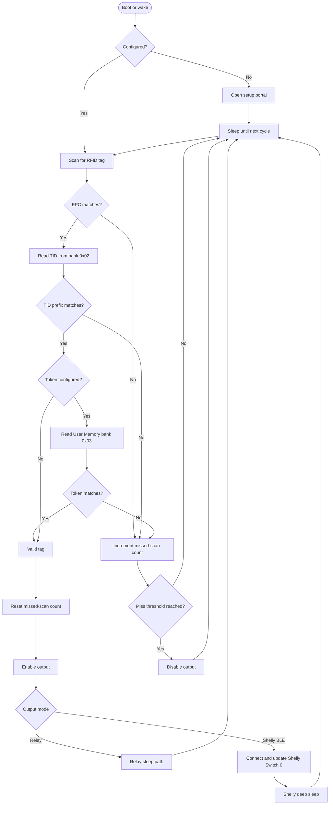
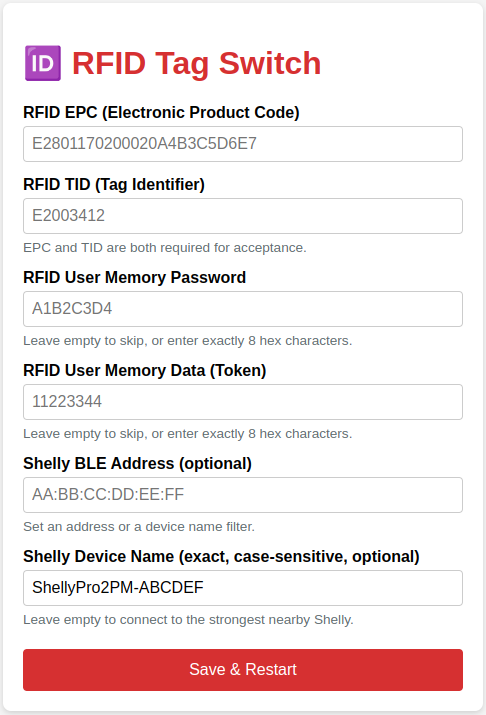
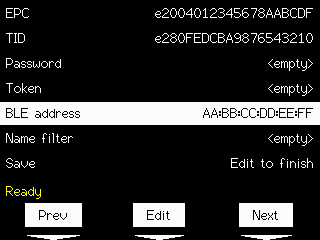

# ESP32 RFID Switch

[](https://github.com/matthias-bs/esp32-rfid-switch/actions/workflows/CI.yml)
[](https://github.com/matthias-bs/esp32-rfid-switch/releases)
[](https://github.com/matthias-bs/esp32-rfid-switch/blob/main/LICENSE)


## Overview

An ESP32-based presence switch using an M5Stack UHF RFID reader in the `860-960 MHz` UHF RFID range, which allows to cover a distance of up to ~1 meter. A configured RFID tag keeps an output active while it is detected. The project provides two Web Config examples and one M5Stack Core2 touch-configured example:

- `rfid-switch-relay` drives a local relay on the GPIO defined by the example.
- `rfid-switch-shelly` controls Switch 0 of a Shelly device over Bluetooth Low Energy (BLE).
- `rfid-switch-core2-gdtouchkeyboard` combines both output paths for M5Stack Core2 and uses `GDTouchKeyboard` instead of the Web Config portal.

The project is intended for periodic, low-power operation. Each wake performs an RFID scan, validates the configured tag, updates the output, and returns to sleep when the selected example allows it.

## Contents

- [Features](#features)
- [How It Works](#how-it-works)
- [Hardware](#hardware)
- [Dependencies](#dependencies)
- [Installation](#installation)
- [Wiring](#wiring)
- [Tag Preparation and Writing](#tag-preparation-and-writing)
- [Configuration](#configuration)
- [Examples](#examples)
- [Runtime Behavior](#runtime-behavior)
- [Security Limitations](#security-limitations)
- [Troubleshooting](#troubleshooting)
- [Development and Testing](#development-and-testing)
- [License](#license)

## Features

- Maximum distance between RFID reader and tag: ~1 meter
- EPC (Electronic Product Code) and TID (Tag Identifier) validation for a configured RFID tag.
- Optional validation of a four-byte token stored in RFID User Memory.
- Configuration stored in ESP32 non-volatile storage. The relay and standalone Shelly examples use a Wi-Fi configuration portal; the Core2 touch example uses local touchscreen configuration.
- Local relay output or Shelly BLE output.
- Periodic scanning with a compile-time presence-removal threshold (number of missed scans).
- Low-power sleep between scans (compile-time defined interval).

## How It Works

On each scan, the reader looks for the configured EPC. If the EPC matches, the reader selects the tag, reads its TID from memory bank `0x02`, and checks the configured TID as a prefix. Both EPC and TID must be configured and must match for the tag to be valid.

If a token is configured, the reader also reads User Memory bank `0x03` using the configured 32-bit access password. The token must contain exactly four bytes and must match the configured eight-character hexadecimal value.

A valid scan resets the missed-scan counter and enables the output. An invalid or absent scan increments the counter. The output turns off after the configured number of consecutive missed scans.

The relay example wakes at the configured sleep interval, which defaults to five seconds (short interval to simplify testing; increase for actual application). The sleep mode depends on whether the relay's configured GPIO is RTC-capable. An RTC-capable GPIO is connected to the ESP32 RTC GPIO subsystem and can retain its output level through deep sleep using GPIO hold; otherwise the example uses light sleep. Shelly mode uses deep sleep on every cycle and reconnects to the Shelly device after waking.

The following flow describes the runtime behavior of both examples. The relay and Shelly branches differ in how they update the output and enter sleep.



The editable source is [`rfid-switch-runtime-flow.mmd`](rfid-switch-runtime-flow.mmd).

## Hardware

Basically any ESP32 board can be used. The main features used are Wi-Fi for web configuration, UART interface for RFID reader communication and either a GPIO pin for direct relay control or Bluetooth Low Energy (BLE) for Shelly switch control.

### RFID Reader and Tags

The [M5Stack Unit UHF-RFID](https://docs.m5stack.com/en/unit/uhf_rfid) is used to scan, select, and read UHF RFID tags. The project uses the maintained [M5Unit-UHF-RFID library](https://github.com/matthias-bs/M5Unit-UHF-RFID) fork for reader communication.

The reader and tags use the [EPCglobal UHF Class 1 Gen2 air-interface protocol](https://ref.gs1.org/standards/gen2/), standardized as [ISO/IEC 18000-63](https://www.iso.org/standard/73599.html), for UHF RFID operation in the 860-960 MHz range.

The examples configure the reader for the European `865-868 MHz` band (reader region `3`); [ETSI EN 302 208](https://www.etsi.org/deliver/etsi_en/302200_302299/302208/03.03.01_60/en_302208v030301p.pdf) provides the regional radio requirements. Make sure the selected region and transmit power comply with local regulations.

Use compatible [UHF RFID tags](https://en.wikipedia.org/wiki/Radio-frequency_identification) with EPC, TID, and optional User Memory. The [RFID tag writer example](examples/rfid-tag-write/rfid-tag-write.ino) identifies tags and initializes the values used by the switch examples.

### Feature Targets

#### Waveshare ESP32-S3-Relay-1CH

[Waveshare ESP32-S3-Relay-1CH](https://www.waveshare.com/esp32-s3-relay-1ch.htm), an ESP32-S3 board with an integrated one-channel relay in a rail-mount housing. See the manufacturer's [ESP32-S3-Relay-1CH Wiki](https://www.waveshare.com/wiki/ESP32-S3-Relay-1CH) for board documentation.

This module has a connector which provides a suitable interface to the RFID Reader.

> [!NOTE]
> On the Waveshare target, relay control uses GPIO 47, which is not RTC-capable. The relay example therefore uses light sleep rather than deep sleep, because the relay output cannot be retained through deep sleep. Other ESP32 hardware may use a different relay GPIO; check the existing hardware definition before changing the example.

#### M5Stack Core2

I selected this target, because I already had it in stock and it seemed to be a natural choice for connecting the M5Unit-UHF-RFID.

[M5Stack Core2](https://docs.m5stack.com/en/core/core2) is an ESP32-based controller with an AXP192- or AXP2101-family power-management chip, touch display, buttons, and M-BUS/Port A expansion.

In the Arduino IDE, select the **M5Stack-Core2** board definition (FQBN `esp32:esp32:m5stack_core2`) and install the M5Unified library.

[M5Stack Guide Rail](https://docs.m5stack.com/en/accessory/guide_rail), an M5Base-series expansion base with spring-loaded rail mounting and M3 screw holes. It can be used when building a rail-mounted Core2 assembly.

Suitable [M5Stack actuator units](https://docs.m5stack.com/en/products?id=UnitActuator_id):
* [Unit Relay](https://docs.m5stack.com/en/unit/relay)
* [2Relay Unit](https://docs.m5stack.com/en/unit/2relay)
* [Unit SSR](https://docs.m5stack.com/en/unit/ssr).

The 2Relay and Unit Relay provide mechanically switched relay outputs, while the Unit SSR provides zero-crossing solid-state switching for AC loads. Check each unit's voltage, load, and wiring specifications before use. See [Electrical safety](#electrical-safety).

> [!NOTE]
> On the featured M5Stack Core2 target, the relay variants use GPIO 32 on Port A (yellow pin). GPIO 32 is RTC-capable, so the relay variants use deep sleep with GPIO hold to retain the relay state between scans. The relay Web Config example switches the display off during runtime and uses the Core2 PMIC power LED as a relay-state indicator; the LED blinks while Web Config is active. The Core2 touch example uses the display during local configuration and switches the backlight off when configuration closes.

### Electrical safety

The relay and Shelly wiring option can involve 230 V mains voltage. Shelly pins may carry lethal voltage and are not necessarily galvanically isolated from mains. Do not connect or change external wiring while the device is energized. Observe the relay's / Shelly device's maximum current ratings. Use an enclosure, suitable clearances (including the relay's coil and switch side), and appropriate mains-rated components, and have installation performed by a qualified person.

The ESP32 uses 3.3 V logic. Check voltage levels before connecting any signal. You must use an appropriate driver for controlling a relay via GPIO. This example does not use, and must not be wired to, the Shelly device's internal connector.

### Leassons learned

#### Grove connection wire colors

> [!CAUTION]
> Grove connection cables do not always follow a common color coding standard! While M5Stack's cables have black - red - **yellow** - **white**, there are other cables which have black - red - **white** - **yellow**. This does not matter for a one-to-one connection, but it does for sure if you are using custom wiring.

#### M5Unit-UHF-RFID range issues

The tag detection range seems to be dependent on the M5Unit-UHF-RFID's power supply quality.

**Work in progress**

## Dependencies

The library declares these dependencies in [`library.properties`](library.properties):

- [M5Unit-UHF-RFID](https://github.com/matthias-bs/M5Unit-UHF-RFID) (fork)
- [M5Unified](https://github.com/m5stack/M5Unified) (required by the Core2 relay build and touch example; not used by the standalone Shelly build)
- [esp32-shelly-ble-rpc](https://github.com/matthias-bs/esp32-shelly-ble-rpc)
- [NimBLE-Arduino](https://github.com/h2zero/NimBLE-Arduino)
- [GDTouchKeyboard](https://github.com/matthias-bs/GDTouchKeyboard) (fork; required by the Core2 touch example)
- [ArduinoJson](https://arduinojson.org/) (required by the RFID tag writer)

> [!CAUTION]
> Use the `master` branch of [matthias-bs/M5Unit-UHF-RFID](https://github.com/matthias-bs/M5Unit-UHF-RFID); the original M5Stack repo or other branches are not supported.

> [!CAUTION]
> Use the `master` branch of [matthias-bs/GDTouchKeyboard](https://github.com/matthias-bs/GDTouchKeyboard); other repo variants or branches are not supported.

You also need an ESP32 Arduino core and a board definition compatible with the selected example.

## Installation

1. Install the ESP32 board package in the Arduino IDE or PlatformIO environment.
2. Install the libraries listed above.
3. Open one of the example sketches under `examples/`.
4. Select the target ESP32 board and serial port.
5. Compile and upload the sketch.
6. For `rfid-switch-relay` and `rfid-switch-shelly`, connect to the configuration access point on first startup and enter the RFID settings. For `rfid-switch-core2-gdtouchkeyboard`, enter the settings through the local touchscreen configuration menu. Shelly switch variants also require a Shelly BLE address or name filter.

For the featured Waveshare target, select the ESP32 Arduino board definition with FQBN `esp32:esp32:esp32s3`.

For the featured M5Stack Core2 target, compile with FQBN `esp32:esp32:m5stack_core2`.

This repository does not include an IDE project file, so the board and serial port must still be selected in your local Arduino environment.

## Wiring

### RFID reader

All sketches use the same RFID UART mapping for a given board:

| Board | RFID reader RX | RFID reader TX |
| --- | ---: | ---: |
| Waveshare ESP32-S3-Relay-1CH | 1 | 2 |
| M5Stack Core2 (Port C) | 13 | 14 |
| ESP32 Dev Module | 16 | 17 |

For the Waveshare ESP32-S3-Relay-1CH, the SH1.0 connector (J5 in the [schematic](https://files.waveshare.com/wiki/ESP32-S3-Relay-1CH/ESP32-S3-Relay-1CH-schematic.pdf)) is wired as follows:

| SH1.0 pin | Signal | Function |
| ---: | --- | --- |
| 1 | GPIO1 | ESP32-S3 IO; connect to the RFID reader TX signal |
| 2 | GPIO2 | ESP32-S3 IO; connect to the RFID reader RX signal |
| 3 | 3V3 | 3.3 V power output |
| 4 | GND | Ground |

For the featured M5Stack Core2 target, connect the M5Stack UHF RFID reader to
Port A. Use the Port A power and ground connections as specified by the reader
and Core2 documentation. The sketches select these pins automatically when
`ARDUINO_M5STACK_CORE2` is defined.

The ESP32 RX pin must connect to the RFID reader's TX signal, and the ESP32 TX
pin must connect to the RFID reader's RX signal. Additionally, the reader's
GND pin must be connected to the common ground of the target board and the 5V
power supply.

Confirm the reader's power requirements and logic levels for your particular hardware.

The examples use Europe region `3` and TX power `2600`. Make sure the selected region and transmit power comply with local regulations.

### Local relay

The examples with a local relay output use these board-specific pins:

| Example | Board | Local relay output |
| --- | --- | ---: |
| `rfid-switch-relay` | Waveshare ESP32-S3-Relay-1CH | 47 (on-board connection) |
| `rfid-switch-relay` | M5Stack Core2 | 32 (Port A, yellow wire) |
| `rfid-switch-relay` | ESP32 Dev Module | 5 |
| `rfid-switch-core2-gdtouchkeyboard` relay variant | M5Stack Core2 | 32 (Port A, yellow wire) |

The relay module must be suitable for the load and powered according to its
specifications. Do not connect mains wiring directly to an ESP32 GPIO.

For the featured M5Stack Core2 target, connect the relay input to GPIO 32 on Port A (the yellow signal pin). The sketch drives the relay input HIGH for enabled and LOW for disabled. Because GPIO 32 supports RTC GPIO hold, the output state is retained while the relay example is in deep sleep.

Relay state retention during sleep depends on whether the selected relay GPIO supports RTC hold on the board. The sketch detects this capability and falls back to light sleep when it is unavailable.

### M5Stack Core2 relay controls and LED

In the relay example, press the Core2 **Button A** touchscreen control during the first three seconds after reset to open configuration mode. This is a virtual touch button handled through M5Unified. Other supported boards use BOOT/GPIO 0 instead. The display backlight is disabled by the example.

The built-in power LED is controlled through the Core2 power-management chip with M5Unified's `M5.Power.setLed()`. It is off when the relay is off and on when the relay is on, including during deep sleep. While the web configuration portal is active, it blinks to indicate configuration mode. This LED is not a general-purpose GPIO output.

### Shelly BLE

The Shelly example communicates with the configured Shelly device over BLE and controls Switch 0. Direct BLE address configuration takes precedence over name-based scanning. If no address is configured, the example scans for five seconds and applies the configured name filter.

Follow the Shelly model's documentation and the safety requirements in [Electrical safety](#electrical-safety).

## Tag Preparation and Writing

The repository provides [`examples/rfid-tag-write/rfid-tag-write.ino`](examples/rfid-tag-write/rfid-tag-write.ino) to inspect tags and initialize their optional access password and User Memory token. It scans continuously and prints each detected tag's EPC and TID. The supplied EPC and TID identify the existing tag; they are not written by this example. Press Enter on an empty line in the Serial Monitor to start a write request. When prompted, send a JSON object; pretty-printed JSON is supported, and the writer detects the closing brace rather than treating each newline as the end of the message.

Use the provided [example tag configuration](extras/rfid_tag_config.json) as a template for the JSON input. See the [example tag-writer log](extras/rfid_tag_write.log) for a sample run.

The JSON fields are:

- `epc`: required, even-length hexadecimal string, maximum 124 characters. It identifies the existing tag and is not written.
- `tid`: required, even-length hexadecimal string, maximum 40 characters. It identifies the existing tag as a case-insensitive prefix and is not written.
- `current_access_password`: optional, empty or exactly 8 hexadecimal characters. An absent or empty value means `00000000`.
- `access_password`: optional new tag password, empty or exactly 8 hexadecimal characters.
- `secret_token`: optional four-byte User Memory value, empty or exactly 8 hexadecimal characters.

When a new `access_password` is supplied, the writer uses `current_access_password` to write it to the tag's Access Password area in Reserved bank `0x00`, starting at word `2`. When `secret_token` is supplied, it is written to User Memory bank `0x03`, User Memory is locked with lock flags `0x030C82`, and the token is verified using the effective password. User Memory is not locked when no token is supplied. This assumes the current password supplied in JSON is correct.

Example:

```json
{
  "epc": "E2801170200020A4B3C5D6E7",
  "tid": "E2003412",
  "current_access_password": "00000000",
  "access_password": "A1B2C3D4",
  "secret_token": "11223344"
}
```

Record the following values for the configuration portal:

- **EPC:** the tag EPC, as an even-length hexadecimal string.
- **TID:** the tag TID, as an even-length hexadecimal string. The configured value is matched as a prefix, so a shorter prefix can be used when appropriate.
- **Password:** optional 32-bit access password, represented by exactly eight hexadecimal characters. An empty password is treated as `00000000`.
- **Token:** optional four-byte User Memory value, represented by exactly eight hexadecimal characters.

EPC and TID are both required for runtime validation, even though the current portal field validators permit empty values. A configuration with either field empty will not validate a tag.

## Configuration

The `rfid-switch-relay` and `rfid-switch-shelly` examples use a Wi-Fi configuration portal. On first boot, or when configuration is requested in either of these examples, the ESP32 starts an access point:

- SSID: `RFID-Switch-Setup`
- Password: `12345678` (compile-time constant)
- Portal: `http://192.168.4.1/`
- Timeout: 300 seconds



For these two examples, connect to the Wi-Fi access point, open the portal, and enter the RFID fields described in [Tag Preparation and Writing](#tag-preparation-and-writing). The shared configuration is stored in the NVS namespace `rfid-switch` under the fields `configured`, `epc`, `tid`, `password`, `token`, `ble_address`, and `name_filter`.

Configuration entry and re-entry are supported as follows. The startup window is the first three seconds after power-on or reset. 'Reader-disconnect discovery' means starting with the RFID reader disconnected; after a power-on or reset, failed reader initialization starts the configuration re-entry. Pressing the dedicated button during the startup window triggers the configuration re-entry. BOOT/GPIO 0 is the default, which can be changed with the define `CONFIG_PIN`.

| Example | Board | Button | Reader-disconnect discovery | Config mode |
| --- | --- | --- | --- | --- |
| `rfid-switch-relay` | Core2 | Press Button A | Yes | Power LED blinking and info display |
| `rfid-switch-relay` | Other | Hold BOOT/GPIO 0 low | Yes | **--** |
| `rfid-switch-shelly` | Core2 | **Not supported** | Yes | Power LED blinking |
| `rfid-switch-shelly` | Other | Hold BOOT/GPIO 0 low | Yes | **--** |
| `rfid-switch-core2-gdtouchkeyboard` | Core2 | Press Button A | No | Config menu active |

For the relay and Shelly examples, a failed RFID reader initialization after power-on or reset starts the Web Config portal. Reader failures after a timer wake return to sleep without starting the portal.

For all runtime switch examples, enter the RFID fields described in [Tag Preparation and Writing](#tag-preparation-and-writing). The Web Config examples enter these fields through the portal, while the Core2 touch-keyboard example enters them through its local touchscreen configuration. Timer wakes do not start the portal.

For Shelly mode, configure either:

- a colon-separated six-byte BLE address, or
- an exact, case-sensitive device name filter of up to 40 characters.

When both are configured, the direct BLE address is used first.

## Examples

### `rfid-switch-relay`

Use this example when the ESP32 directly controls a relay. It scans at the configured sleep interval, which defaults to five seconds, drives the relay GPIO defined by the example, and uses deep sleep with RTC GPIO hold only when that GPIO supports it on the selected board. Change `RFID_SLEEP_DURATION_SECONDS` in the example to adjust the interval, then recompile and upload the sketch.

For M5Stack Core2, the example uses Button A for configuration, GPIO 32 on Port A for the relay, GPIO 13/14 for the UHF reader, and the built-in power LED as a relay/configuration indicator. The LED state is retained during deep sleep.

### `rfid-switch-shelly`

Use this example when the output is a Shelly device controlled over BLE. It reconnects after each wake, targets Shelly Switch 0, and enters deep sleep between cycles. A connection or RPC failure does not falsely mark the Shelly output as changed.

On non-Core2 boards, the existing BOOT/GPIO 0 startup trigger remains available. On Core2, the power-management LED blinks during configuration, shows the confirmed Shelly Switch 0 state when available, and blinks three times for BLE or RPC failure. The standalone Shelly example does not use the Core2 display.

#### Core2 LED behavior and implementation

The Shelly example controls the Core2 power-management LED directly over the internal I2C bus. A lightweight helper detects whether the board uses an AXP192 or AXP2101 PMIC and selects the matching LED register. The implementation keeps M5Unified out of the standalone Shelly build, avoiding its known [IRAM0 overflow issue](docs/IRAM0_SEGMENT_OVERFLOW.md).

### `rfid-switch-core2-gdtouchkeyboard`

Use this example on an M5Stack Core2 when configuration should be entered locally on the touchscreen instead of through a Wi-Fi access point. It does not provide a Web Config portal. The sketch contains both the relay and Shelly BLE output paths, selected at compile time with `RFID_SWITCH_VARIANT_RELAY` or `RFID_SWITCH_VARIANT_SHELLY`. The relay variant is selected by default.

To build the Shelly variant, define `RFID_SWITCH_VARIANT_SHELLY`. To build the relay variant explicitly, define `RFID_SWITCH_VARIANT_RELAY`, either in the source code or via compile command parameter:

```text
arduino-cli compile --fqbn esp32:esp32:m5stack_core2 \
  --build-property build.extra_flags=-DRFID_SWITCH_VARIANT_RELAY \
  examples/rfid-switch-core2-gdtouchkeyboard
```

Define exactly one variant. Defining both flags is a compile-time error.

For Core2 RFID wiring, see [RFID reader](#rfid-reader); connect the relay module to Port A. The relay driver is controlled by GPIO 32. The example requires the Core2 display, touchscreen, buttons, and power LED, so it uses `M5Unified`.

On first boot, or when Button A is pressed during the first three seconds after reset, the touchscreen configuration overview appears:



- Button A selects the previous field.
- Button C selects the next field.
- Button B edits the selected field.
- Touch `Prev`, `Edit`, or `Next` in the overview to perform that action.
- Navigate to `Save` and press Button B or touch `Edit` to save the settings and start the RFID runtime.

The overview status `Ready` means that the current values pass validation. It does not save the settings or indicate that the RFID runtime has started. EPC and TID are required even-length hexadecimal values. Password and token are optional eight-character hexadecimal values.

The keyboard uses Button A to delete, Button B to accept, and Button C to change keyboard mode. The display backlight is on while configuring and is switched off when configuration closes.

Both variants configure EPC, TID, password, and token. The Shelly variant additionally accepts either a colon-separated BLE address or a case-sensitive name filter. A direct BLE address takes precedence when both are configured. These settings use the shared `rfid-switch` NVS namespace and keys as the other examples.

In Shelly mode, the Core2 power LED shows the last confirmed Shelly relay state across deep sleep: off means relay off and full brightness means relay on. A three-blink sequence indicates that the Shelly state is currently unavailable, for example after a BLE connection or RPC failure. A later wake that successfully reads the Shelly state restores the normal relay-state indication.

## Runtime Behavior

The presence controller is called once per wake by both examples. The examples use their configured removal threshold:

| Condition | Result |
| --- | --- |
| Valid EPC, TID, and optional token | Miss counter resets; output is enabled |
| No tag or invalid tag | Miss counter increments |
| Configured number of consecutive missed scans reached | Output is disabled |
| Shelly connection failure | No output-state update is reported |

The relay example wakes on a configurable timer, set to five seconds by default in the example. Its output retention during sleep is board-dependent. Shelly mode disconnects after each loop and performs a fresh BLE connection after the next wake.

## Security Limitations

This project is an identification and presence mechanism, not cryptographic authentication.

- EPC values can be read and cloned.
- TID checks and User Memory tokens add validation conditions but do not establish a cryptographic identity.
- An access password can protect User Memory operations on supported tags, but it does not make the EPC a secret.
- Physical access to the tag and reader should be considered when assessing the system.

Do not use this project as the sole security control for safety-critical access, locks, or other systems where tag cloning must be prevented.

## Troubleshooting

### The Core2 touch configuration does not appear

- Confirm that the `rfid-switch-core2-gdtouchkeyboard` example is running on an M5Stack Core2.
- Press Button A during the first three seconds after reset to force configuration.
- Use the overview controls to edit fields, then press and release Button B to finish. EPC and TID must be valid even-length hexadecimal values.
- Recompile after changing the relay/Shelly compile-time variant.

### The configuration portal does not appear

- Confirm that the sketch is running and the ESP32 has completed reset.
- Check that the device is not already configured.
- In the relay example, press the Core2 virtual Button A during the first three seconds after reset. On other supported boards, hold BOOT/GPIO 0 (or your custom button) low during that window.
- In the standalone Shelly example on Core2, disconnect the RFID reader before power-on or reset. The portal starts after reader initialization fails.
- Connect via Wi-Fi to `RFID-Switch-Setup` and browse to `192.168.4.1`.
- Check serial output and allow for the five-minute portal timeout.

### A known tag is rejected

- Confirm that EPC and TID are both configured and contain hexadecimal values.
- Check EPC case and spelling; comparison is case-insensitive but exact.
- Check the configured TID prefix against the tag's TID memory bank.
- If a token is configured, verify the eight hexadecimal characters, access password, and User Memory contents.
- Verify UART crossover wiring and reader power.

### The relay does not retain its state during sleep

The GPIO used for the relay must support RTC GPIO hold on the selected board for deep-sleep retention. RTC-capable GPIOs are connected to the ESP32's RTC GPIO subsystem, allowing their output level to be held during deep sleep. The sketch uses light sleep when the configured relay GPIO lacks that capability. Check the existing hardware definition and the board's GPIO and sleep support before changing the wiring or sketch.

### Shelly mode cannot find or control the device

- Confirm that the Shelly address is valid, or that the configured name matches exactly and with the correct case.
- Keep the Shelly within BLE range during the scan.
- Remember that a configured direct address takes precedence over name scanning.
- Confirm that the target output is Switch 0.
- Check serial output for connection and RPC failures.

## Development and Testing

The repository includes a GitHub Actions [CI build matrix](.github/workflows/CI.yml) that compiles the examples for ESP32-S3 and M5Stack Core2. It has no automated runtime or hardware test suite. For local builds, use an ESP32 Arduino environment with the declared dependencies installed.

When changing validation, sleep, or output behavior, test both examples on the intended hardware. In particular, verify relay behavior on the actual board because RTC GPIO support is board-dependent.

## License

This project is licensed under the MIT License. See [`LICENSE`](LICENSE) for the full license text.
